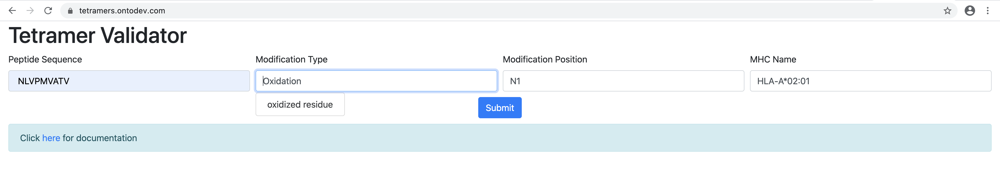

# MHC Multimer documentation

## Table of Contents

* [Description](#description)
* [Installation](#installation)
  * [Command Line](#command-line)
  * [Local Web Server](#local-web-server)
  * [Docker image](#docker-image)
* [Usage and Instructions](#usage-and-instructions)
  * [General Usage Instructions](#general-usage-instructions)
  * [Command Line](#command-line-1)
  * [Web Form](#web-form)
* [Examples](#examples)
  * [Valid Entry](#valid-entry)
* [Contact Information](#contact-information)

## Description
The [Multimer Validation Tool](http://tools.iedb.org/mhcmultimer) is...

[TODO: Add abstract/link to paper]

## Installation

### Command Line 

If you would like to run the validator tool on the command line, please clone the Git repository and install using `pip`

```
git clone https://github.com/IEDB/tetramer-validator.git
cd tetramer-validator
pip install .
```
To confirm installation run `tv -h`

### Local Web Server

**Flask is a prerequisite for running this validator on a local web server.**

If you would like to run the validator on a local web server, please follow the instructions for setting up the command line usage.  

Then install Flask by entering in the following command:

```
pip install -r requirements.txt
cd tetramer_validator
export FLASK_APP=server.py
flask run
```

By default, Flask will launch applications on [http://127.0.0.1:5000](http://127.0.0.1:5000).

Enter this address in your browser.

### Docker image

If you wish to run the validator in a Docker container, please use the Dockerfile from the Git repo to build the image. 

Please download the Git repo. 

```
git clone https://github.com/IEDB/tetramer-validator.git
cd tetramer-validator/tetramer_validator

```
In `server.py`, uncomment lines `220-221` to have the app run on [http://0.0.0.0:5000](http://0.0.0.0:5000).

Then build the Docker image.
 
```
cd tetramer-validator
docker build -t mhcmultimer:latest .
docker run -p 5000:5000 mhcmultimer:latest
``` 
Navigate to your web browser to load the Web form at [http://0.0.0.0:5000](http://0.0.0.0:5000).
## Usage and Instructions
### General Usage Instructions
1. Please enter MHC molecule and peptide sequence. Both of these fields are required. Optionally, one can enter modification information.
2. MHC molecule name should be chosen to conform to [MHC Restriction ontology](https://www.ebi.ac.uk/ols/ontologies/mro).
3. Modification Position field should be a comma separated list of amino acid letter followed by position number (e.g. F1, S10, S300). Each modification position should be of the format `<amino acid><position>`
4. Modification type should be chosen to conform to [PSI-MOD ontology](https://www.ebi.ac.uk/ols/ontologies/mod).  
5. Either modification position **and** modification type must be provided or no modification information should be entered.
6. There should be equal number of modification positions and modification types.
7. NULL is not an appropriate value for any field. Please leave empty if there is no appropriate value.

### Command Line
The tool allows you to run command line validation on a table of MHC Multimer entries that is saved as Excel Spreadsheet (`.xlsx`), a tab-separated file (`.tsv`), or a comma-separated file (`.csv`).  

```
usage: tv [-h] [-o OUTPUT] filename

positional arguments:
  filename              Please enter .tsv, .csv, or .xlsx filename and that
                        the following is in the header row: Peptide Sequence,
                        Modification Type, Modification Position, MHC Molecule

optional arguments:
  -h, --help            show this help message and exit
  -o OUTPUT, --output OUTPUT
                        Enter output file text name.
```    

### Web Form
In order to assist user, the MHC Molecule and Modification Type fields output suggestions that conform to MHC Restriction ontology and PSI-MOD ontology, respectively.  Please use the suggested names to ensure successful validation.

## Examples

### Valid Entry

See below for an example on entering an entry into the web form.

* MHC Molecule: HLA-A*02:01
* Peptide Sequence: NLVPMVATV
* Modification Type: Oxidation
* Modification Position: M5




* Notice that the the display name of for Oxidation is oxidized residue for Oxidation. Please choose from the display names or else validation will not be successful. 
* Notice that syntax of M5. The modification is at the position 5 and the amino acid is methionine.  

## Contact Information
* [Issue Tracker](https://github.com/IEDB/tetramer-validator/issues)
* [Email](mailto:help@iedb.org)
