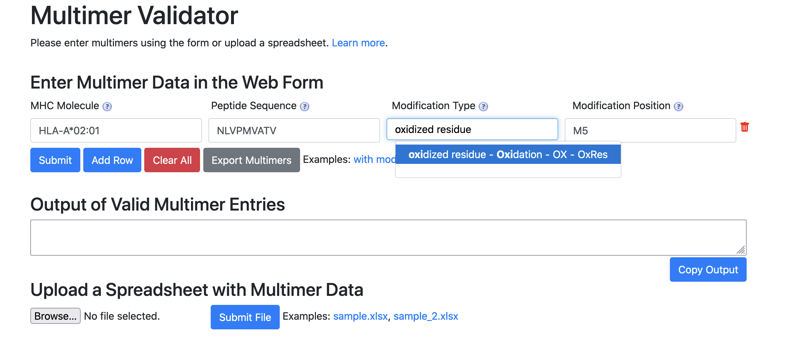

# MHC Multimer documentation

## Table of Contents

* [Description](#description)
* [Installation](#installation-and-deployment-on-local-web-server)
  * [Command Line](#command-line)
  * [Local Web Server](#local-web-server)
  * [Docker Image](#docker-image)
* [Usage and Instructions](#usage-and-instructions)
  * [General Usage Instructions](#general-usage-instructions)
  * [Command Line](#command-line-1)
  * [Web Form](#web-form)
	  * [Local Web Deployment Outside of Docker Container](#local-web-deployment-outside-of-docker-container)
	  * [Example of Valid Entry on Web Form](#example-of-valid-entry-on-web-form)
* [Contact Information](#contact-information)

## Description
The [Multimer Validation Tool](http://tools.iedb.org/mhcmultimer) is a tool designed to validate multimers according to the [MIAMM standard](http://miamm.lji.org).

## Installation and deployment on local web server

As a preliminary step, please download or clone the Git repository and go to the directory with the repository. 

```
git clone https://github.com/IEDB/tetramer-validator.git
cd tetramer-validator
```

### Command Line

If you would just like to run the validator tool by passing in the filename with the data on the command line, install using command `pip install .`

Run `tv -h` to ensure installation and generate a usage message.

### Local Web Server

The above steps for installation ensures you can run the validator on the command line interface by passing in a filename with the data on multimers.

To get a local web server going, first follow the steps above to install the command line interface.  Then install Flask.

Please enter the following command to install and run the Flask server locally.

```
pip install -r requirements.txt
tv webserver
```

If you would like additional options for local web deployment, please consult the [usage message](#local-web-deployment-outside-of-docker-container).  

### Docker Image

If you wish to run the validator in a Docker container, please use the Dockerfile from the Git repo to build the image. 

Please enter the following command to build the Docker image and run the Docker container.

```
docker build -t mhcmultimer:latest .
docker run -p 5000:5000 mhcmultimer:latest
``` 

## Usage and Instructions
### General Usage Instructions
1. Please enter MHC molecule and peptide sequence. Both of these fields are required. Optionally, one can enter modification information.
2. MHC molecule name should be chosen to conform to [MHC Restriction ontology](https://www.ebi.ac.uk/ols/ontologies/mro).
3. Modification Position field should be a comma separated list of a valid standard amino acid letter followed by the position number within the peptide sequence (e.g. F1, S10, S13). Each modification position should be in the format of letter followed by number (`<amino acid><position>`)
4. Modification type should be chosen to conform to [PSI-MOD ontology](https://www.ebi.ac.uk/ols/ontologies/mod).  
5. Either both modification position **and** modification type must be provided or neither should be entered.
6. There should be equal number of modification positions and modification types.
7. NULL is not an appropriate value for any field. Please leave empty if there is no appropriate value.

### Command Line
The tool allows you to run command line validation on a table of MHC Multimer entries that is saved as Excel Spreadsheet (`.xlsx`), a tab-separated file (`.tsv`), or a comma-separated file (`.csv`).

The following is the usage message for running command line validation.  

```
usage: tv cmd_line [-h] [-o OUTPUT] filename

positional arguments:
  filename              Please enter .tsv, .csv, or .xlsx filename and that
                        the following is in the header row: Peptide Sequence,
                        Modification Type, Modification Position, MHC Molecule

optional arguments:
  -h, --help            show this help message and exit
  -o OUTPUT, --output OUTPUT
                        Enter output file text name.
```    

### Web Form
In order to assist user, the MHC Molecule and Modification Type fields output suggestions that conform to MHC Restriction ontology and PSI-MOD ontology, respectively.  Please use the suggested names to ensure successful validation.

#### Local Web Deployment Outside of Docker Container

```
usage: tv webserver [-h] [--host HOST] [--port PORT] [--debug]

optional arguments:
  -h, --help   show this help message and exit
  --host HOST  If this option is not specified, host will default to 127.0.0.1
  --port PORT  If this option is not specified, port will default to 5000
  --debug      Option used to specify if Flask server should start in debug
               mode
```

#### Example of Valid Entry on Web Form

See below for an example on entering an entry into the web form.

* MHC Molecule: HLA-A*02:01
* Peptide Sequence: NLVPMVATV
* Modification Type: Oxidation
* Modification Position: M5




* Notice that the the display name of for Oxidation is oxidized residue for Oxidation. Please choose from the display names or else validation will not be successful. 
* Notice that syntax of M5. The modification is at the position 5 and the amino acid is methionine.  

## Contact Information
* [Issue Tracker](https://github.com/IEDB/tetramer-validator/issues)
* [Email](mailto:miamm@lji.org)
